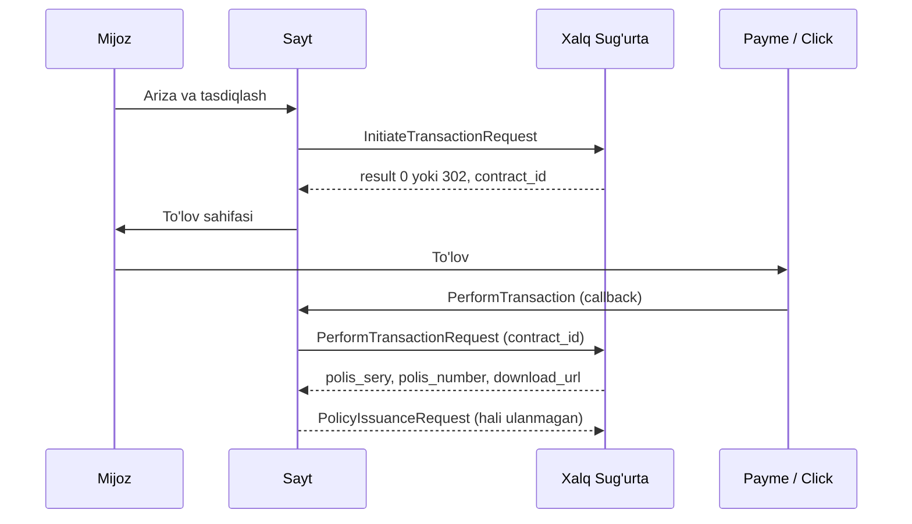

# Online Xalq Sug'urta API

Bu hujjat new.xalqsugurta.uz sayti `online.xalqsugurta.uz` tizimi bilan qanday ishlashini tushuntiradi: shaxs va avtomobilni qidirish, narxni hisoblash, shartnoma tuzish va to'lovni tasdiqlash. API'larni tizim egasi bo'lgan korxona beradi. Namunalar ular yuborgan misollar va sayt kodidagi amaldagi so'rovlar asosida yozilgan.

- **Host:** `online.xalqsugurta.uz`
- **Protokol:** HTTP, Basic Auth, JSON
- **Holati:** 2026-yil sentabr

## Mundarija

- [Kirish](#kirish)
- [Avtorizatsiya](#avtorizatsiya)
- [Formatlar va javob kodlari](#formatlar-va-javob-kodlari)
- [Endpointlar xaritasi](#endpointlar-xaritasi)
- [Proxy: davlat bazalaridan ma'lumot olish](#proxy-davlat-bazalaridan-malumot-olish)
- [Universal API: gaz ballon, Mening uyim, KASKO](#universal-api-gaz-ballon-mening-uyim-kasko)
- [Baxtsiz hodisa](#baxtsiz-hodisa-websiteaccident)
- [OSGOR](#osgor-ish-beruvchi-javobgarligi-eshop)
- [OSGOP](#osgop-tashuvchi-javobgarligi-eshop)
- [OSAGO](#osago)
- [Tashqi servislar](#tashqi-servislar)
- [Kodda qayerda](#kodda-qayerda)
- [Korxonaga ochiq savollar](#korxonaga-ochiq-savollar)

---

## Kirish

Tizim Oracle ORDS asosida ishlaydi. Barcha manzillar `http://online.xalqsugurta.uz/xs/ins/…` bilan boshlanadi. API'lar beshta guruhga bo'linadi. Har guruhning o'z manzili, ba'zilarining esa o'z logini bor.

> **Muhim.** Manzil noto'g'ri bo'lsa yoki ORDS so'rovni qabul qilmasa, server JSON emas, **HTML sahifa bilan 404** qaytaradi. Javob `<!DOCTYPE html>` bilan boshlansa, avval URL'ni tekshiring, keyin body'ni.

> **Xavfsizlik.** Ulanish HTTPS emas, oddiy HTTP orqali ketadi, ya'ni login va shaxsiy ma'lumotlar tarmoqda ochiq uzatiladi. Korxonadan HTTPS manzil so'rash tavsiya qilinadi.

## Avtorizatsiya

Hamma so'rovlar HTTP Basic Auth bilan yuboriladi. Loginlar kodda yozilmaydi, ular serverdagi `.env` faylida turadi.

| Login guruhi | `.env` kalitlari | Qaysi API'lar uchun |
|---|---|---|
| Asosiy (XWEB) | `PROVIDER_USERNAME`, `PROVIDER_PASSWORD` | Proxy, `eshop/*` (OSGOR, OSGOP), `website/accident/*` |
| Universal (gazballonsayt) | `XALQ_USERNAME`, `XALQ_PASSWORD` | `unv/gazballonsayt/*`: gaz ballon, Mening uyim, KASKO |
| OSAGO | `INSURANCE_OSAGO_USERNAME`, `INSURANCE_OSAGO_PASSWORD` | `doraosago/create` |

Qo'shimcha sozlamalar:
- `PROVIDER_BASE_URL`: proxy manzili.
- `PROVIDER_SENDER_PINFL`: so'rov yuboruvchi xodimning PINFL'i.
- `PROVIDER_AGENCY_ID`: agentlik raqami, standart qiymati `126` (OSGOP'da tasdiqlangan; sug'urtachi namunasidagi `546` bizning loginga tegishli emas). Admin panelda Tizim → Sug'urtachi API orqali ham o'zgartiriladi.

## Formatlar va javob kodlari

| Narsa | Qoida |
|---|---|
| Sana | Universal API (`unv`): `DD.MM.YYYY`. Qolgan hamma API: `YYYY-MM-DD`. |
| Telefon | `998XXXXXXXXX`: 12 raqam, `+` belgisiz |
| Pasport | Universal API'da bitta qator (`AB1234567`). Boshqalarida `seria` va `number` alohida yoziladi. |
| PINFL | 14 ta raqam. 1-raqam asr va jinsni bildiradi, 2–7-raqamlar tug'ilgan sana (`DDMMYY`). |
| Jins | `1` erkak, `2` ayol. Universal API'da son (int) bo'lishi shart. |
| Mamlakat / hudud | `countryId: 210` (O'zbekiston), `regionId: 10` (Toshkent sh.). Tuman raqami (`districtId`) to'rt xonali, masalan `1009`. |
| Summa | So'mda, butun son. OSGOR'da tiyinli satr ham ishlatiladi (`"253102.54"`). |

### Natija kodi

| Maydon | Qiymat | Ma'nosi |
|---|---|---|
| `result` | `0` | Muvaffaqiyatli (calc, sale, eshop, unv) |
| `result` | `302` | Faqat `InitiateTransaction` uchun: muvaffaqiyatli deb qabul qilinadi |
| `result` | boshqa | Biznes xatosi, sababi `result_message` maydonida |
| `error` | `0` / boshqa | Faqat proxy uchun. Xato matni `error_message` da, ma'lumot esa `result` ichida keladi. |

## Endpointlar xaritasi

Yo'llar `/xs/ins` dan keyingi qismi bilan berilgan.

| Guruh | Metod | Yo'l | Vazifasi | Saytda |
|---|---|---|---|---|
| Proxy | POST | `/osago/proxy` + `param` header | Shaxs, tashkilot, avto, haydovchi | ✅ ishlaydi |
| Universal | POST | `/unv/gazballonsayt/InitiateTransactionRequest` | Shartnoma yaratish (35, 36, 37) | ✅ ishlaydi |
| Universal | POST | `/unv/gazballonsayt/PerformTransactionRequest` | To'lovni tasdiqlash | ✅ ishlaydi |
| Universal | POST | `/unv/gazballonsayt/PolicyIssuanceRequest` | Polis chiqarish | ⏳ ulanmagan |
| Baxtsiz hodisa | GET | `/website/accident/products` | Mahsulotlar va limitlar | — ishlatilmaydi |
| Baxtsiz hodisa | POST | `/website/accident/calc` | Mukofotni hisoblash | ✅ ishlaydi |
| Baxtsiz hodisa | POST | `/website/accident/sale` | Shartnoma va to'lov havolasi | ❌ 404 qaytaryapti |
| OSGOR | POST | `/eshop/osgorcalc`, `/eshop/osgor` | Hisoblash, shartnoma | ✅ ishlaydi |
| OSGOP | POST | `/eshop/osgopcalc`, `/eshop/osgop` | Hisoblash, shartnoma | ✅ ishlaydi |
| OSAGO | POST | `/doraosago/create` | Shartnoma | ✅ ishlaydi |

---

## Proxy: davlat bazalaridan ma'lumot olish

`POST http://online.xalqsugurta.uz/xs/ins/osago/proxy`

- **Auth:** asosiy (XWEB)
- **Timeout:** 10 s, 3 marta qayta urinish

Barcha qidiruvlar bitta manzilga yuboriladi. Qaysi xizmat kerakligi `param` header'ida ko'rsatiladi, HTTP metodi esa `mtd` header'ida.

```http
Authorization: Basic <PROVIDER_USERNAME:PROVIDER_PASSWORD>
Content-Type: application/json
mtd: POST
param: /api/provider/pinfl-v2
```

### `param` qiymatlari

| param | Body | Qaytaradi |
|---|---|---|
| `/api/provider/pinfl-v2` | `transactionId`, `isConsent`, `senderPinfl`, `document`, `pinfl` | Shaxs (asosiy usul) |
| `/api/provider/passport-birth-date-v2` | `transactionId`, `isConsent`, `senderPinfl`, `document`, `birthDate` | Shaxs (eski usul, ba'zan ishlamaydi) |
| `/api/provider/inn` | `inn` | Tashkilot |
| `/api/provider/osago/vehicle` | `techPassportSeria`, `techPassportNumber`, `govNumber` | Transport vositasi |
| `/api/provider/driver-summary-v2` | `transactionId`, `isConsent`, `pinfl`, `document`, `senderPinfl` | Haydovchilik guvohnomasi |
| `/api/provider/cadaster-info` | `cadasterNumber` | Kadastr (hozir saytda ishlatilmaydi) |

**So'rov: shaxsni PINFL bo'yicha topish**

```json
{
  "transactionId": 1759046400,
  "isConsent": "Y",
  "senderPinfl": "<PROVIDER_SENDER_PINFL>",
  "document": "AB1234567",
  "pinfl": "31501991234567"
}
```

**Javob (qisqartirilgan)**

```json
{
  "error": 0,
  "result": {
    "currentPinfl": "31501991234567",
    "lastNameLatin": "ALIYEV",
    "firstNameLatin": "VALI",
    "middleNameLatin": "ANVAR O‘G‘LI",
    "birthDate": "1999-01-15",
    "gender": "1",
    "address": "…",
    "regionId": 10,
    "districtId": 1007
  }
}
```

> **Eslatma.** `pinfl-v2` pasport qachon va kim tomonidan berilganini qaytarmaydi. Bu ma'lumot talab qilinadigan joyda (baxtsiz hodisa sale) sayt `issuedBy: "Not specified"` va bugungi sanani yuboradi. Ism-sharifda `‘` va `ʻ` belgilari kelishi mumkin.

---

## Universal API: gaz ballon, Mening uyim, KASKO

Uchala mahsulot bitta API orqali ishlaydi va bir-biridan faqat `loan_type` qiymati bilan farq qiladi.

| Mahsulot | `loan_type` | Obyekt bloki | Mukofot stavkasi (saytda) |
|---|---|---|---|
| Gaz ballon sug'urtasi | `"35"` | `loan_info.cadastr_info` | 0,5% |
| Mening uyim (mol-mulk) | `"36"` | `loan_info.cadastr_info` | 0,2% |
| KASKO | `"37"` | `vehicle_info` + `organization` | 3% |

### Jarayon



### InitiateTransactionRequest

`POST http://online.xalqsugurta.uz/xs/ins/unv/gazballonsayt/InitiateTransactionRequest`

- **Auth:** universal
- **Sana formati:** `DD.MM.YYYY`
- **Muvaffaqiyat:** `result` 0 yoki 302

Shartnomani yaratadi, to'lovdan oldin chaqiriladi. Mijoz tasdiqlash sahifasida "To'lash" tugmasini bosganda yuboriladi.

**Umumiy maydonlar**

| Maydon | Turi | Izoh |
|---|---|---|
| `subject` | string | `"P"`: jismoniy shaxs |
| `customer.full_name` | string | Familiya Ism Otasining ismi |
| `customer.birth_date` | string | `DD.MM.YYYY` |
| `customer.gender` | int | `1` yoki `2` |
| `customer.passport` | string | Seriya va raqam birga: `AB1234567` |
| `customer.pinfl`, `phone`, `address` | string | Telefon `998XXXXXXXXX` |
| `customer.inn`, `oked`, `bxm`, `ras_sum`, `subj_mfo`, `representativename` | — | Tashkilot uchun. Jismoniy shaxsda yuborilmaydi. |
| `loan_info.loan_type` | string | `"35"` / `"36"` / `"37"` |
| `loan_info.contract_number`, `claim_id` | string | Sayt yaratadigan noyob raqam (`GAS-…`, `PROP-…`, `KASKO-…`) |
| `loan_info.contract_date`, `s_date`, `e_date` | string | Shartnoma sanasi, boshlanishi, tugashi |
| `loan_info.loan_amount` | int | Sug'urta summasi (KASKO). Kadastrli mahsulotlarda `cadastr_info.sum_bank` ishlatiladi. |

**35 / 36: kadastrli mahsulot (namuna)**

```json
{
  "customer": {
    "address": "г. Ташкент, ул. Мира, д. 1",
    "birth_date": "01.11.1999",
    "full_name": "Петров Петр Петрович",
    "gender": 1,
    "passport": "AB1234567",
    "phone": "998901234567",
    "pinfl": "12345678901234"
  },
  "loan_info": {
    "cadastr_info": {
      "address": "Адрес имущества",
      "building_type": 1,
      "cadastr_issue_date": "01.01.2026",
      "cadastr_number": "01:02:03:04:05",
      "country": 210,
      "description": "г. Ташкент, ул. Мира, д. 5",
      "districtid": 1009,
      "is_foreign": 0,
      "is_owner": 1,
      "name": "Название имущества",
      "note": "Информация об имуществе",
      "region_code": "10",
      "regionid": 10,
      "right_land_type": 1,
      "subject_full_name": "Петров Петр Петрович",
      "sum_bank": 95000000
    },
    "claim_id": "987654321",
    "contract_date": "01.01.2026",
    "contract_number": "123-D",
    "e_date": "31.12.2026",
    "loan_type": "35",
    "s_date": "01.01.2026"
  },
  "subject": "P"
}
```

Gaz ballonda sayt `building_type` va `right_land_type` ni yubormaydi, lekin `loan_info.object_name` ni qo'shadi. Mening uyim namunadagidek to'liq yuboriladi.

**37: KASKO (namuna)**

```jsonc
{
  "customer": { /* yuqoridagidek */ },
  "loan_info": {
    "claim_id": "987654321",
    "contract_date": "01.01.2026",
    "contract_number": "123-D",
    "e_date": "31.12.2026",
    "loan_amount": 50000000,
    "loan_type": "37",
    "object_brand": "CHEVROLET",
    "object_name": "NEXIA - 150",
    "s_date": "01.01.2026"
  },
  "organization": { /* avtomobil egasi: customer bilan bir xil maydonlar */ "subject": "P" },
  "subject": "P",
  "vehicle_info": {
    "bodynumber": "XWB5M31BDA277889",
    "enginenumber": "F18D32229751",
    "regnumber": "40Z202EA",
    "techpassport": { "number": "3332961", "seria": "AAC" },
    "type": 2,
    "year": 2011
  }
}
```

Individual KASKO'da avtomobil egasi arizachining o'zi, shuning uchun sayt `organization` blokiga `customer` ma'lumotlarini qo'yadi.

**Javob**

Sayt javobdan quyidagi maydonlarni o'qiydi. Keyingi bosqich uchun eng muhimi `contract_id`.

| Maydon | Saytda nima uchun |
|---|---|
| `result`, `result_message` | Natija. `0` yoki `302` bo'lsa buyurtma yaratiladi. |
| `contract_id` (yoki `id`) | To'lovdan keyingi `PerformTransactionRequest` uchun kerak |
| `polis_sery`, `polis_number` | Buyurtma raqami sifatida saqlanadi |
| `amount`, `payme_url`, `click_url` | Faqat KASKO'da o'qiladi (kelsa) |

### PerformTransactionRequest

`POST http://online.xalqsugurta.uz/xs/ins/unv/gazballonsayt/PerformTransactionRequest`

- **Auth:** universal
- **Timeout:** 60 s, 3 marta qayta urinish
- **Muvaffaqiyat:** `result` 0

Payme yoki Click to'lov muvaffaqiyatli bo'lganini xabar qilgandan keyin chaqiriladi va shartnomani to'langan deb belgilaydi. `contract_id` bo'lmasa, so'rov yuborilmaydi va logga xato yoziladi.

**So'rov**

```json
{
  "contract_date": "01.09.2026",
  "contract_id": 123456,
  "contract_number": "123-D",
  "e_date": "31.08.2027",
  "payment_date": "01.09.2026",
  "s_date": "01.09.2026"
}
```

**Javob (sayt o'qiydigan maydonlar)**

```json
{
  "result": 0,
  "polis_sery": "…",
  "polis_number": "…",
  "polis_check": "…",
  "download_url": "…"
}
```

`contract_number` uchun avval `polis_sery-polis_number` olinadi. U bo'lmasa, Initiate'da yuborilgan raqam ishlatiladi. `download_url` buyurtmaga saqlanadi va mijozga polisni yuklab olish havolasi sifatida ko'rsatiladi.

### eshop/payment (to'lovni tasdiqlash)

`POST http://online.xalqsugurta.uz/xs/ins/eshop/payment` (`config('provider.payment.eshop')`)

- **Auth:** eshop (provider username/password)
- **Timeout:** 60 s, 3 marta qayta urinish
- **Muvaffaqiyat:** `result` 0

eshop shartnomalari (OSGOP, OSGOR, baxtsiz hodisa, turist) saytning o'z Payme / Click kassasi orqali to'langanda (sug'urtachi `payme_url` / `click_url` bermagan bo'lsa) chaqiriladi. Body `PerformTransactionRequest` bilan bir xil:

```json
{
  "contract_date": "01.09.2026",
  "contract_id": 123456,
  "contract_number": "123-D",
  "e_date": "31.08.2027",
  "payment_date": "01.09.2026",
  "s_date": "01.09.2026"
}
```

- `contract_id` — sotuv javobidagi `contract_id`; bo'lmasa so'rov yuborilmaydi.
- `contract_number` — javobdagi `contract_number` / `number` / `polis_sery-polis_number`, bo'lmasa sotuvda yuborilgan `number` (OSGOP, OSGOR), keyin `insurance_id`.
- `contract_date` — buyurtma yaratilgan kun; `s_date` / `e_date` — shartnoma muddati; `payment_date` — bugun.
- Javob namunasi hali berilmagan: `download_url`, `polis_sery`, `polis_number` kelsa buyurtmaga saqlanadi.

Kod: `App\Services\EshopPaymentService`, chaqiruvchi `App\Services\InsurerConfirmation` (Payme `PerformTransaction` va Click `Complete` dan keyin, javob yuborilgach). Admin: buyurtma kartasida "To'lovni tasdiqlash", ro'yxatda "To'lov tasdiqlanmagan" tab.

### PolicyIssuanceRequest

`POST http://online.xalqsugurta.uz/xs/ins/unv/gazballonsayt/PolicyIssuanceRequest`

- **Auth:** universal
- **Holati:** ⏳ saytga ulanmagan

Polis chiqarish uchun mo'ljallangan. Manzil korxona tomonidan berilgan, lekin so'rov va javob formati hali kelmagan, shuning uchun sayt bu endpointni chaqirmaydi. Ulash uchun korxonadan body va javob namunasi, shuningdek u qaysi bosqichda chaqirilishi kerakligi (Perform'dan keyinmi yoki alohida) haqida ma'lumot kerak.

---

## Baxtsiz hodisa (website/accident)

Bitta shartnomada bir nechta sug'urtalanuvchi bo'lishi mumkin. Mukofot har bir shaxs uchun alohida hisoblanadi. Mahsulot kodlari: `202` baxtsiz hodisa, `203` turist.

### products

`GET http://online.xalqsugurta.uz/xs/ins/website/accident/products`

- **Auth:** asosiy (XWEB)

Mahsulotlar ro'yxatini va ularning limitlarini qaytaradi. Masalan, `202` uchun `liability_min` 10 000 va `liability_max` 1 000 000. Saytda summa chegaralari hozircha qo'lda yozilgan: 50 000 dan 1 000 000 so'mgacha, qadami 50 000.

### calc

`POST http://online.xalqsugurta.uz/xs/ins/website/accident/calc`

- **Auth:** asosiy (XWEB)
- **Sana formati:** `YYYY-MM-DD`

**So'rov**

```json
{
  "details": {
    "productCode": "202",
    "startDate": "2026-10-01",
    "endDate": "2027-09-30"
  },
  "persons": [
    { "sumInsured": "500000" }
  ]
}
```

**Javob**

```jsonc
{
  "result": 0,
  "persons": [
    { "insurancePremium": 1500 /* … */ }
  ],
  "cost": { "insurancePremium": 1500 }
}
```

> **Muhim.** `startDate` va `endDate` bo'lmasa, calc "Ошибка даты начало страхования" xatosini qaytaradi. Korxona namunasida sanalar yo'q, lekin ular majburiy.

### sale

`POST http://online.xalqsugurta.uz/xs/ins/website/accident/sale`

- **Auth:** asosiy (XWEB)
- **Timeout:** 30 s
- **Holati:** ❌ saytdan yuborilganda HTML 404 qaytaradi

Shartnomani yaratadi va to'lov havolalarini qaytaradi. Postman'da ishlaydi, lekin saytdan yuborilganda HTML ko'rinishidagi 404 qaytmoqda (sababi [Korxonaga ochiq savollar](#korxonaga-ochiq-savollar) bo'limida).

**So'rov**

```jsonc
{
  "applicant": {
    "person": {
      "passportData": {
        "pinfl": "31501991234567", "seria": "AB", "number": "1234567",
        "issuedBy": "Not specified", "issueDate": "2026-09-28"
      },
      "fullName": { "firstname": "VALI", "lastname": "ALIYEV", "middlename": "ANVAR OGLI" },
      "residentType": 1,
      "phone": "998901234567",
      "birthDate": "1999-01-15",
      "address": "…",
      "countryId": 210, "regionId": 10, "districtId": 1009
    }
  },
  "details": { "productCode": "202", "startDate": "2026-10-01", "endDate": "2027-09-30" },
  "cost": { "sumInsured": 500000, "insurancePremium": 1500 },
  "persons": [
    {
      /* applicant.person bilan bir xil maydonlar */
      "sumInsured": 500000,
      "insurancePremium": 1500
    }
  ]
}
```

`cost` blokida barcha shaxslar bo'yicha jami summa va jami mukofot yoziladi. Korxona namunasida `productCode` matn ko'rinishida (`"personal_accident"`), calc esa `"202"` ni qabul qiladi. Sale uchun qaysi qiymat to'g'riligini korxonadan aniqlashtirish kerak.

**Javob (Postman, 200)**

```json
{
  "result": 0,
  "contract_id": 123456,
  "amount": 1500,
  "payme_url": "https://checkout.paycom.uz/…",
  "click_url": "https://my.click.uz/…"
}
```

> **Diqqat.** Test uchun ham 200 javob **haqiqiy shartnoma** yaratadi.

---

## OSGOR: ish beruvchi javobgarligi (eshop)

### osgorcalc

`POST http://online.xalqsugurta.uz/xs/ins/eshop/osgorcalc`

- **Auth:** asosiy (XWEB)
- **Javob:** `policies[0]`

```json
{
  "insurant": { "organization": { "oked": "58290" } },
  "policies": [ { "fot": 500000000 } ]
}
```

Javobning `policies[0]` elementidan `insurancePremium`, `insuranceSum`, `insuranceRate`, `funeralExpensesSum` va `insuranceTermId` olinadi. `fot` — ish haqi fondi.

### osgor

`POST http://online.xalqsugurta.uz/xs/ins/eshop/osgor`

- **Auth:** asosiy (XWEB)
- **Muvaffaqiyat:** `result` 0

```json
{
  "number": "1-5/4-4/0025",
  "sum": "443261886.34",
  "contractStartDate": "2026-02-01",
  "contractEndDate": "2027-02-01",
  "regionId": "10",
  "areaTypeId": "1",
  "agencyId": "546",
  "comission": "0",
  "insurant": {
    "organization": {
      "inn": "123456789",
      "name": "\"NAMUNA\" MCHJ",
      "representativeName": "…",
      "address": "…",
      "oked": "86230",
      "position": "Директор",
      "checkingAccount": "20208000…",
      "phone": "998901234567",
      "regionId": "10",
      "ownershipFormId": "130"
    }
  },
  "policies": [
    {
      "issueDate": "2026-02-01",
      "startDate": "2026-02-01",
      "endDate": "2027-02-01",
      "insuranceSum": "443261886.34",
      "insuranceRate": "0.05710",
      "insurancePremium": "253102.54",
      "insuranceTermId": 4,
      "funeralExpensesSum": "1020000",
      "fot": 443261886.34
    }
  ]
}
```

Sayt yuboradigan body namunadan farqlari:
- `issueDate` bugungi sana;
- `checkingAccount` faqat INN qidiruvi hisob raqamini qaytarsa qo'shiladi (`checkingAccount` / `account` / `bankAccount` / `settlementAccount`);
- `fot` satr sifatida ketadi (namunada raqam). Shu shaklda qabul qilindi: `result 0`, `contract_id`, `amount`, `payme_url`, `click_url`, `uuid` qaytadi;
- `agencyId` — `Tizim → Sug'urtachi API` (OSGOP bilan bir xil).

Javobdan `contract_id` olinadi. U bo'lmasa, `polis_sery` + `polis_number` ishlatiladi.

---

## OSGOP: tashuvchi javobgarligi (eshop)

### osgopcalc

`POST http://online.xalqsugurta.uz/xs/ins/eshop/osgopcalc`

- **Auth:** asosiy (XWEB)
- **Javob:** `policies[0]`

```json
{
  "policies": [
    {
      "insuranceTermId": 4,
      "objects": [ { "vehicle": { "vehicleTypeId": 2, "numberOfSeats": 30 } } ]
    }
  ]
}
```

### osgop

`POST http://online.xalqsugurta.uz/xs/ins/eshop/osgop`

- **Auth:** asosiy (XWEB)
- **Muvaffaqiyat:** `result` 0

Tuzilishi OSGOR'ga o'xshaydi (`number`, `sum`, `contractStartDate`, `regionId`, `agencyId`, `insurant`, `policies`). Farqi shundaki, `policies[0].objects[0].vehicle` blokida transport ma'lumotlari keladi:

| Maydon | Izoh |
|---|---|
| `healthLifeDamageSum`, `propertyDamageSum` | Limitlar: sozlamada 40 000 000 va 4 000 000. **Satr** bo'lishi shart (`"40000000"`): raqam yuborilsa `422 … must be a string` qaytadi, namunada raqam bo'lsa ham |
| `agencyId` | `PROVIDER_AGENCY_ID`. Login egasining tashkilotiga tegishli bo'lishi kerak, aks holda `The selected agency does not belong to your insurance organization` |
| `vehicle.techPassport`, `govNumber`, `vehicleTypeId`, `issueYear`, `bodyNumber`, `engineNumber`, `numberOfSeats` | Proxy'dagi `osago/vehicle` javobidan olinadi |
| `vehicle.vehicleTypeId` | **OSGOP jadvali bo'yicha** (sug'urtachining VEHICLETYPEID ro'yxati: 1 avtobus, 2 yengil avtomobil, 7 mikroavtobus, …), reyestrdagi raqam emas. Moslash (`OsgopController::osgopType()`): reyestr 1/2 → 2; reyestr 9 (avtobus va mikroavtobus) → 20 o'rindiqdan ko'p bo'lsa 1, aks holda 7; boshqa turlar onlayn sotilmaydi. 20 chegarasi loyihadagi reyestr turi nomidan olingan, sug'urtachi tasdiqlamagan |
| `insuranceTermId` | Sug'urtachi jadvali: 4 = 1 yil, 8 = 9 oy, 3 = 6 oy, 7 = 3 oy (`insurance_terms` jadvali bilan bir xil) |
| `vehicle.license` | Tashuvchi litsenziyasi: `seria`, `number`, `beginDate`, `endDate` mijoz kiritadi (reyestrda yo'q); `typeCode` sug'urtachi namunasidagi matn (turi bo'yicha) |
| `vehicle.ownerPerson` yoki `ownerOrganization` | Egasi kimligiga qarab faqat bittasi yuboriladi; ikkinchisi umuman qo'shilmaydi |

> Body oddiy UTF-8 da yuboriladi (`JSON_UNESCAPED_UNICODE`), Postman namunasidagidek; `‘ ’ ʻ ʼ` apostroflari oddiy `'` ga almashtiriladi (`plainApostrophes()`), namunadagi `MAS'ULIYATI` kabi. PHP'ning standart `\u2018` / `\u0414` escape'lari bilan ham xuddi shu `999.JSON parse error` qaytgan (`O‘G‘LI` kabi ismlar). API jurnali body'ni MySQL JSON ustunida saqlaydi, shuning uchun u yerda escape'lar va kalitlar tartibi ko'rinmaydi.
>
> Litsenziyasiz va `ownerPerson: null` bilan yuborilgan so'rovga `{"result": -40000, "result_message": "999.JSON parse error: "}` qaytgan edi. Reyestr turini to'g'ridan-to'g'ri yuborganda yengil avtomobil avtobus tarifida hisoblangan.
| `vehicle.regionId` | API `0` qaytarsa, arizachining hududi qo'yiladi |

---

## OSAGO

`POST http://online.xalqsugurta.uz/xs/ins/doraosago/create`

- **Auth:** OSAGO
- **Timeout:** 10 s, 3 marta qayta urinish

Body'ning asosiy bloklari: `vehicle`, `owner`, `applicant`, `details`, `drivers`, `cost`. Javobda `result = 0` va `UUID` bo'lsa muvaffaqiyatli hisoblanadi; `amount`, `payme_url`, `click_url` ham keladi. Xatoda `result_message` qaytadi.

Body'ni `OsagoController::applicationBody()` yig'adi:

| Maydon | Qayerdan |
|--------|----------|
| `vehicle.*` (`typeId`, `govNumber`, `techPassport`, `bodyNumber`, `engineNumber`, `issueYear`, `modelCustomName`) | Proxy'dagi `osago/vehicle` javobi (sessiyada) |
| `vehicle.regionId` | Ariza beruvchining hududi |
| `owner.person`, `applicant.person` | `pinfl-v2`; pasport kim va qachon bergani `documents[]` dagi mos yozuvdan (`docgiveplace`, `datebegin`) |
| `drivers[]` | `pinfl-v2` + `driver-summary-v2` (`DriverInfo.licenseSeria`, `licenseNumber`, `issueDate`); 5 tagacha |
| `cost.insurancePremium` | `OsagoPriceCalculator`: 80 mln × ТБ (turi) × КТ (01/10 = 1.2) × КБО (cheklanmagan 2 / cheklangan 1) / 100 |
| `cost.contractTermConclusionId` | `1` (12 oy; boshqa muddat sotuvda yo'q) |
| `cost.useTerritoryId` | Raqam 01 yoki 10 bilan boshlansa `1`, aks holda `2` |

**Yuridik shaxs (egasi tashkilot).** Admin panelda Tizim → Sug'urtachi API → "Yuridik shaxslarga sotish" (yoki `OSAGO_LEGAL_ENTITIES=true`) yoqilganda sotiladi; standart holatda o'chiq. Sug'urtachi bunday body namunasini bermagan, shuning uchun sayt jismoniy shaxs holatining ko'zgusini yuboradi:

| Maydon | Qiymat |
|--------|--------|
| `owner.organization.inn` | Kiritilgan INN (`/api/provider/inn` bo'yicha tekshiriladi) |
| `owner.person.*`, `applicant.person.*` | Bo'sh satrlar |
| `owner.applicantIsOwner` | `"true"` — tashkilot ariza beruvchi ham |
| `applicant.organization` | `{phoneNumber, inn, name}` (nom INN qidiruvidan) |
| `vehicle.regionId` | INN javobidagi `regionId`, bo'lmasa SOATO'ning birinchi 2 raqami, bo'lmasa `10` |

Yoqqandan keyin bitta sinov sotuvini qilib, API jurnalida javobni tekshirish kerak; sug'urtachi boshqa shakl so'rasa `OsagoController::applicationBody()` o'zgartiriladi.

---

## Tashqi servislar

| Servis | Manzil | Izoh |
|---|---|---|
| Kadastr | `https://impex-insurance.uz/api/fetch-cadaster` | Gaz ballon va Mening uyim sahifalari kadastrni shu yerdan oladi. Uning o'rniga proxy'dagi `/api/provider/cadaster-info` ham ishlatsa bo'ladi. |
| Payme, Click | — | To'lov. Muvaffaqiyatli callback kelgach `PerformTransactionRequest` chaqiriladi. |

## Kodda qayerda

| Fayl | Nima bor |
|---|---|
| `config/provider.php` | Barcha manzillar va `.env` kalitlari |
| `app/Services/Provider/ProviderApiTrait.php` | Proxy, calc, sale, eshop va `InitiateTransactionRequest` chaqiruvlari |
| `app/Traits/ConfirmPayment.php` | `PerformTransactionRequest` |
| `app/Http/Controllers/Insurence/{GasBallon,Property,Kasko}Controller.php` | Universal API body'lari (`build…ApiBody`) |
| `app/Http/Controllers/Insurence/AccidentController.php` | Baxtsiz hodisa sale body'si |
| `app/Http/Controllers/Insurence/BaseInsuranceController.php` | Shaxs javobini sayt formatiga o'girish (`normalizePerson`) |
| `app/Services/InsuranceApiService.php` | OSAGO |

Muammoni topish uchun loglar: `storage/logs/laravel.log`. Qidirish uchun kalit so'zlar: `Provider HTTP Error`, `Accident Submit HTTP Error`, `Xalq Sugurta Submit`, `PerformTransactionRequest failed`.

## Korxonaga ochiq savollar

1. **PolicyIssuanceRequest:** so'rov va javob namunasi kerak. Qachon chaqiriladi: `PerformTransactionRequest` dan keyinmi yoki uning o'rnigami?
2. **accident/sale 404:** Postman'da 200 qaytaradi, saytdan yuborilganda HTML 404. Aniqlashtirish kerak:
   - `productCode` ning qaysi qiymati to'g'ri: `"202"` yoki `"personal_accident"`?
   - `issuedBy` / `issueDate` bo'sh kelsa, ular qabul qilinadimi?
   - `districtId` ning qaysi qiymatlari ruxsat etilgan?
3. **InitiateTransaction javobidagi result 302** nimani anglatadi va u doim muvaffaqiyat deb hisoblanadimi?
4. **Pasport berilgan sana va joy:** `pinfl-v2` bu ma'lumotni qaytarmaydi. Uni qaytaradigan boshqa metod bormi?
5. **HTTPS:** API'ni shifrlangan ulanish orqali ishlatish imkoni bormi?
6. **Loginlarni almashtirish:** hozirgi loginlar ochiq kanallar orqali uzatilgan, ularni yangilash kerak.
